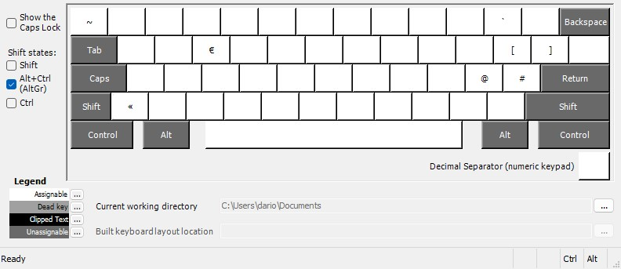
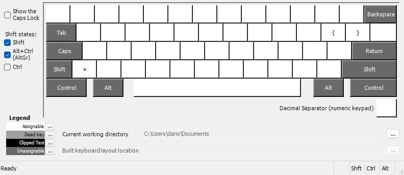

# ItaDev – Layout di Tastiera Italiano per Sviluppatori  

Un layout alternativo per tastiera italiana pensato per gli sviluppatori: permette di accedere rapidamente a simboli, parentesi e caratteri tecnici tramite combinazioni intuitive con AltGr, mantenendo invariato il layout italiano standard.

---

## 🚀 Perché esiste questo layout
Il layout italiano ufficiale è ottimizzato per la scrittura comune, ma poco per la programmazione.  
Simboli come `{}`, `[]`, `~`, `` ` ``, `@`, `#` o `\` richiedono combinazioni scomode o mani fuori posizione.

**ItaDev** risolve il problema:
- mantiene *completamente* la disposizione italiana tradizionale
- aggiunge i simboli più usati nello sviluppo software
- utilizza solo combinazioni con **AltGr** e **Shift + AltGr**

---

## 🧩 Caratteristiche principali
- Basato sul layout Italiano QWERTY
- Nessuna modifica ai caratteri normali
- Aggiunta di simboli essenziali per programmatori
- Ideale per:
  - Web development (JS, TS, PHP, HTML, CSS…)
  - Backend (Node.js, Laravel…)
  - Terminale e CLI

---

## ⌨️ Mappa dei tasti aggiunti

### AltGr

### Shift + AltGr

---

## 📦 Installazione (Windows)

1. Scarica l’ultima release dalla sezione **Releases** su GitHub  
2. Avvia `setup.exe`  
3. Riavvia Windows  
4. Attiva il layout in:
   **Impostazioni → Lingua → Tastiera → Aggiungi layout**

Non sostituisce il layout italiano: lo affianca.

---

## 🛠 Tecnologia
Realizzato con **Microsoft Keyboard Layout Creator (MSKLC)**.

Il repository include:
- File sorgente `.klc`
- Build installabile
- Screenshot del layout (AltGr e Shift+AltGr)

---

## 📣 Contributi
Suggerimenti e miglioramenti sono benvenuti.  
Apri una *Issue* o una *Pull Request* per proporre modifiche.

---

## 📄 Licenza
MIT — libero utilizzo e modifica.

